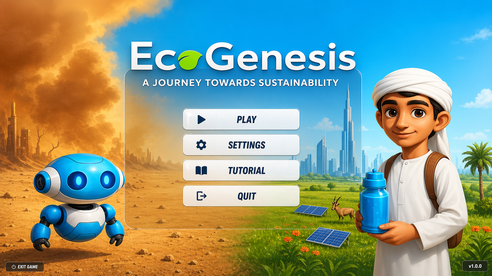
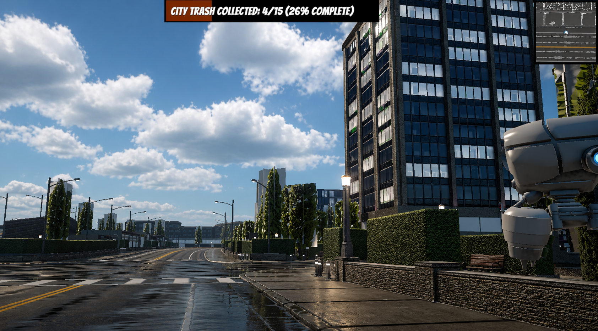
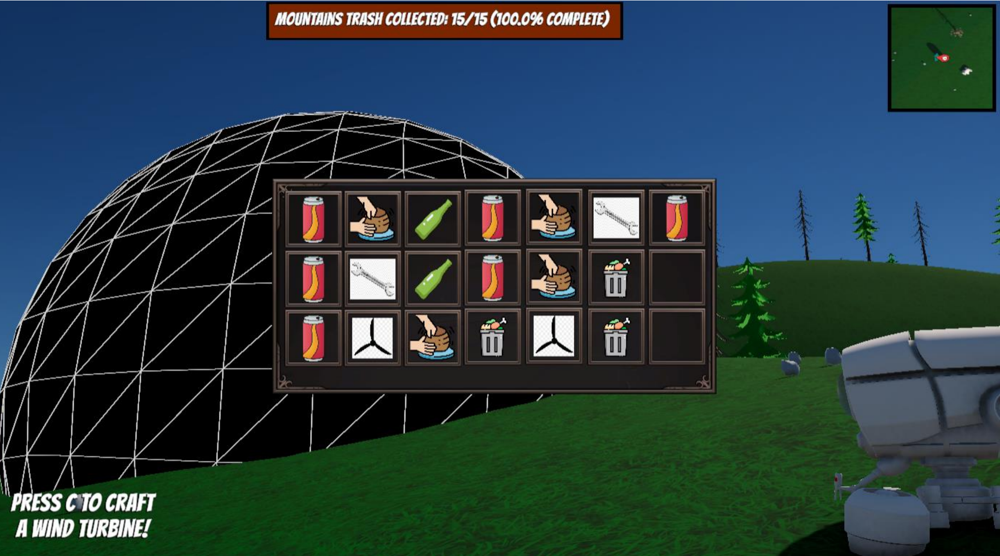
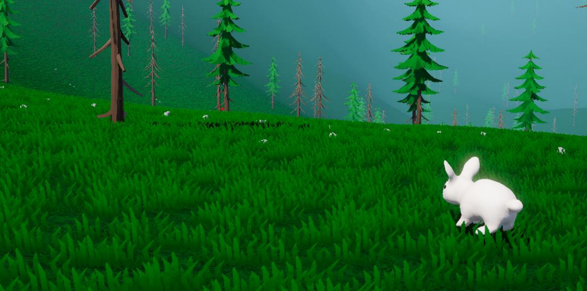
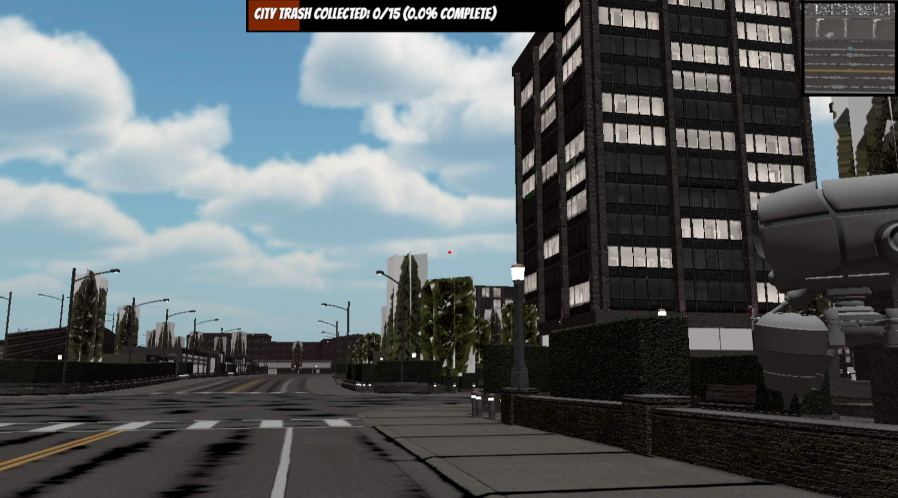

# EcoGenesis

[](https://unity3d.com/get-unity/download)
[]()


## 🌍 Overview

**EcoGenesis** is an immersive environmental restoration game set in a near-future UAE where players take on the role of an environmental restoration specialist. Working alongside ECHO, an AI companion, players must restore three vital ecosystems that have been damaged by pollution and industrial waste.

## 🎮 Game Features

### Core Gameplay
- **Three Unique Environments**: Mountains, Desert, and City areas to restore
- **Environmental Education**: Learn about UAE's ecosystem and sustainability practices
- **AI Companion**: ECHO provides guidance and environmental facts throughout the journey
- **Pollution Collection**: Find and clean up 15 pieces of pollution in each area
- **Hydrogen Fuel System**: Collect sustainable hydrogen fuel from sand and mountain sources


### Technical Features
- **First-Person Controller**: Smooth movement and interaction system
- **Inventory Management**: Track collected items and resources
- **Fuel Management**: Jetpack system with fuel consumption and collection
- **Dialog System**: Interactive conversations with the AI companion
- **Particle Effects**: Visual feedback for collection and environmental interactions

## 🎯 Educational Goals

EcoGenesis aims to raise awareness about:
- UAE's environmental challenges and solutions
- Sustainable energy practices (hydrogen fuel production)
- Desert and mountain ecosystem conservation
- Urban pollution management
- UAE Vision 2050 environmental goals

## 🕹️ Controls

| Input | Action |
|-------|--------|
| `WASD` | Move character |
| `Mouse` | Look around |
| `E` | Interact/Collect items |
| `F` | Call ECHO for assistance |
| `ESC` | Open AI chat interface |
| `Left Click` | Collect pollution items |
| `Space` | Jetpack (when fuel available) |

## 🛠️ Technical Requirements

### Unity Version
- **Unity 2022.3 LTS** or later

### Dependencies
- TextMeshPro
- Unity Input System
- StarterAssets (First Person Controller)
- OpenAI API for Unity (AI chat functionality)

### Platform
- **Windows PC** (Primary target)
- Expandable to other platforms

## 🚀 Getting Started

### Prerequisites
1. Unity 2022.3 LTS or later
2. Visual Studio or preferred C# IDE
3. Git for version control

### Installation
1. Clone the repository:
   ```bash
   git clone https://github.com/abdalrahman-ismaik/EcoGenesis.git
   ```
2. Open the project in Unity Hub
3. Load the `SampleScene` or main game scene
4. Configure OpenAI API key for ECHO functionality (optional)

### Running the Game
1. Open Unity and load the project
2. Navigate to `Assets/Scenes/` and open the main scene
3. Press Play in the Unity Editor
4. Start your environmental restoration journey!

## 📁 Project Structure

```
Assets/
├── Scripts/           # Game logic and systems
├── Scenes/           # Game levels and environments
├── Prefabs/          # Reusable game objects
├── Materials/        # Visual materials and textures
├── Audio/            # Sound effects and music
├── Resources/        # Runtime-loaded assets
└── Settings/         # Project configuration files
```

## 🤝 Contributing

This project is part of an educational initiative. For contributions:

1. Fork the repository
2. Create a feature branch (`git checkout -b feature/amazing-feature`)
3. Commit your changes (`git commit -m 'Add some amazing feature'`)
4. Push to the branch (`git push origin feature/amazing-feature`)
5. Open a Pull Request

## 🌟 Acknowledgments

- Dr. Jamal Zemerly
- Dr. Lamees Alqasem

## 📸 Screenshots

### Main Menu


### City Biome


### Inventory & Crafting


### AI Behaviour / Wildlife



## 📸 Screenshots

### City Scene



### Inventory & Crafting


### AI Behaviour / Wildlife

---


*EcoGenesis - Restoring our world, one ecosystem at a time* 🌱


im gonna add Assets/Images/ecogenesis-main-menu.png and Assets/Images/city-biome.png
